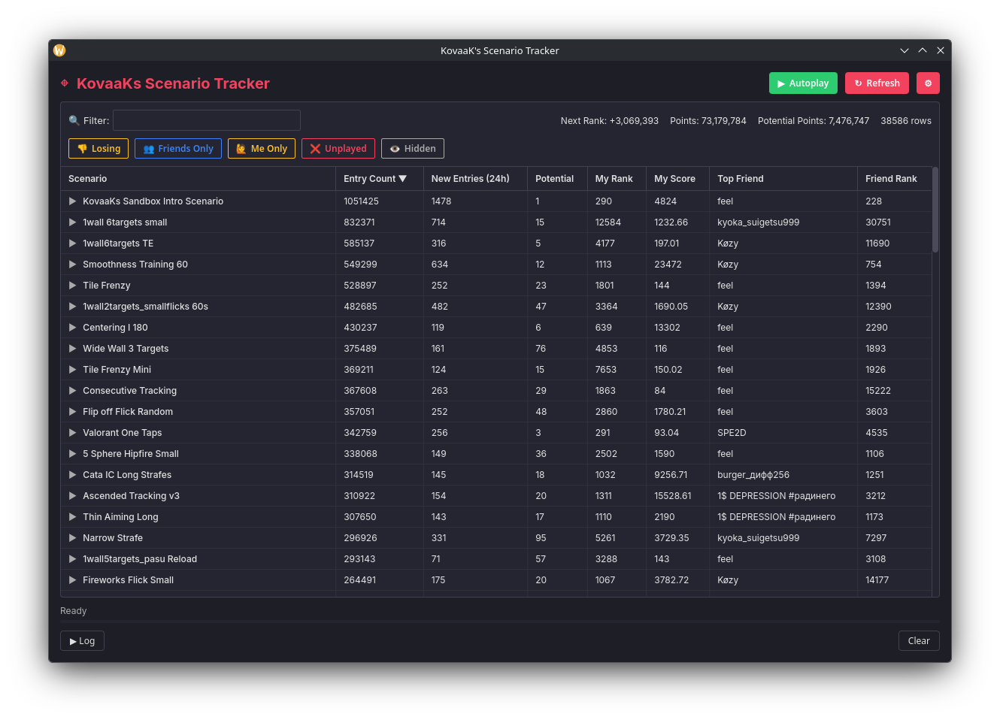

# ⌖ KovaaKs Scenario Tracker

A vibe-coded tracker for KovaaKs. Built for rank farming, sniping friends, and optimizing your practice.



## Features

- **Rank Tracking** — Live updates via KovaaKs API with accurate stats (unlike the official website).
- **Friend Sniping** — Compare scores side-by-side.
- **Potential Score** — Smart practice algorithm recommending scenarios based on skill gap, fatigue, and trends.
- **Autoplay** — Automatically launches the next scenario after you finish a run.

## Setup

1. **Clone & Install**:
   ```bash
   git clone https://github.com/naxeron/kovaaks-tracker.git
   cd kovaaks-tracker
   pip install -r requirements.txt
   ```
   *Note for Linux users (especially Arch Linux) running the Web UI*:
   `pywebview` requires system-level GUI/WebKit backends. For the forced GTK backend on Arch Linux, run:
   ```bash
   sudo pacman -S python-gobject webkit2gtk-4.1
   ```
   For Debian/Ubuntu-based systems, run:
   ```bash
   sudo apt install python3-gi python3-gi-cairo gir1.2-gtk-3.0 gir1.2-webkit2-4.1
   ```

2. **Run**:
   ```bash
   python kovaaks_web.py
   ```
   This opens the desktop app, which uses a web-based interface.
3. **Login**: Enter your KovaaKs credentials.

Generated dataset snapshots have been removed from Git history. If you cloned
before that cleanup, make a fresh clone to benefit from the reduced size. Keep
your local settings and cached scores when moving to it.

## Controls

- **▶ Play**: Click the play icon or double-click a row to launch in KovaaKs.
- **🔁 Autoplay**: Enable to auto-advance through your list.
- **⟳ Refresh**: Sync latest scores and scenarios.
- **Right-click a column header**: Hide/show columns.
- **Right-click a row**: Play, copy the scenario name, or hide/unhide the scenario.

## Scenario data

The tracker downloads `scenarios.json.gz` and `scenarios_history.json.gz` from the
[Scenario data prerelease](https://github.com/Naxeron/kovaaks-tracker/releases/tag/scenario-data).
The scheduled workflow refreshes these two assets in place, without committing
generated files to the repository. Unchanged datasets are not uploaded again.
Scenario history retains up to 168 hourly samples.

If downloads fail, the tracker can fetch scenarios directly from the KovaaKs API.
If neither source returns scenarios, it keeps the previous cache. Update older
tracker checkouts to use release downloads; their former raw GitHub URLs will no
longer provide the shared datasets after this migration.

To generate data locally, preserving the previous published history:

```bash
python scripts/publish_scenarios.py bootstrap --repo Naxeron/kovaaks-tracker --output-dir data
python scripts/fetch_scenarios.py --min-entries 10 --output-dir data
```

The generated files are ignored by Git. Bootstrap requires both valid release
assets; an incomplete or corrupt release fails instead of resetting history.
The release was seeded before removing dataset snapshots from Git history.
The pinned legacy seed is only for the initial migration and may be unavailable
after history cleanup. Keep the release intact and use the recovery procedure
below to restore damaged assets.

GitHub replaces release assets individually. Publishing failures preserve the
successfully generated pair as a `scenario-data-recovery` workflow artifact for
seven days. To repair a missing or corrupt asset, download and extract that
artifact, then validate and restore both files with the authenticated GitHub CLI:

```bash
python - <<'PY'
from pathlib import Path
from scripts.publish_scenarios import ASSET_NAMES, validate_dataset
for name in ASSET_NAMES:
    validate_dataset(name, (Path("recovery") / name).read_bytes())
PY
gh release upload scenario-data recovery/scenarios.json.gz recovery/scenarios_history.json.gz --repo Naxeron/kovaaks-tracker --clobber
```

Keep the data release mutable so its assets can be replaced. It is a prerelease
and does not take the place of the latest application release.

## Tests

```bash
python -m pip install -r requirements.txt pytest
python -m pytest -q
```

Tests use temporary caches, settings, logs, and stats directories. Install Node.js
to include the JavaScript rendering tests; those tests are skipped when Node.js
is unavailable. GitHub Actions runs the suite on Python 3.10 and 3.14 for pushes
and pull requests.
CI also validates workflow syntax and expression contexts with actionlint.

## Credits

- **evxl.app** - For making an actually functional website using the mess that is the KovaaKs API: [https://evxl.app/](https://evxl.app/)

---
*Open an issue if you hit bugs or have ideas. I might be slow to respond, depends on how I feel, my Antigravity quota and if I'm actively playing.*

[](https://deepwiki.com/Naxeron/kovaaks-tracker)
